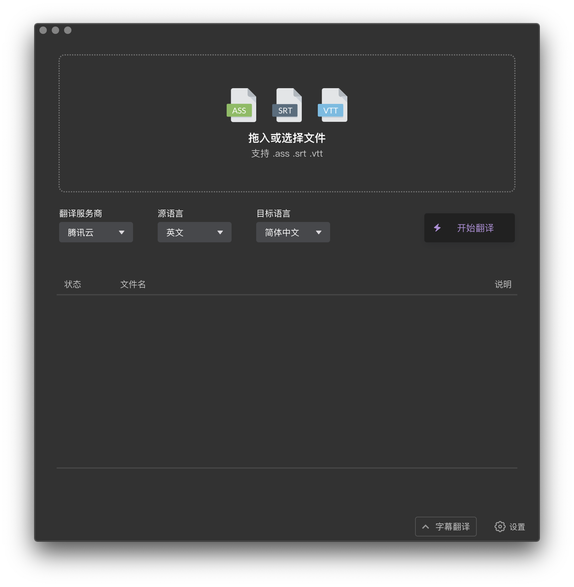
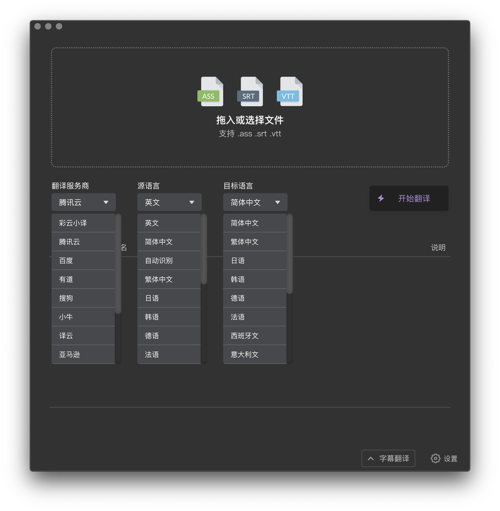

## 字幕组机翻小助手 - [下载地址](https://github.com/1c7/Translate-Subtitle-File/releases) - [演示视频](https://www.bilibili.com/video/av82675511)
桌面端软件，支持 Windows + macOS

## 外观

## 解决的问题：1. 可以翻译字幕文件
举例：拖入英语字幕，翻译成中英双语字幕   

### 说明
1. 也可以只保留中文。      
2. 也支持其他语言如德语，法语，日语，韩语，俄语，西班牙语，意大利语       
只要翻译服务商支持，软件都支持    
3. 支持主流字幕格式 srt/ass/vtt   

## 解决的问题：2. 可以语音转文字          
举例：拖入音频或视频，识别出文字，然后输出为"纯文本"或"字幕"    

说明：
1. 如果选择输出为字幕，还可以进行后续翻译        
2. 目前只支持一家服务商：IBM，更多服务商后续会陆续添加     
3. 可以做到拖入一个英文 mp4/mkv 视频，得到中英双语字幕      

## Windows 截图

## macOS 截图

## 适合什么人用?
1. 个人/普通人/你和我
1. 字幕组（翻译视频的人）

## 使用场景
1. 个人：看些视频教程或其他类型的没字幕的视频，机翻一下字幕，对质量要求不高，大概看懂 80% 内容就行   
1. 字幕组：用机器翻译对字幕文件进行粗加工，然后手动改进机翻字幕，这样效率更高，产出更多

（备注：如果你对质量要求很高，要求翻译出来的中文字幕正确流畅，最好的办法当然是雇人翻译。机翻准确度只有 50%~80% 左右，期望值不要太高）   

## 如何使用？
1. 进入"设置"。配置一家翻译服务商（比如彩云小译） 
1. 拖入字幕文件 (后缀 .srt .ass .vtt)
2. 选择服务商为"彩云小译", 然后选字幕源语言，比如"英文"，然后选目标语言，比如"中文"
3. 点击右侧"开始翻译"按钮即可

## 软件价格
软件分为两个版本:
1. 免费版（适合95%的人）
2. 专业版

## 免费版的特点
* 每月最多翻译100万字符               

## 专业版的特点
* 翻译字符无上限
* 支持字符数统计功能，  
可以看到用腾讯云翻译了 25 万个字符，用百度翻译了 7 万个字符，用谷歌翻译了 10 万个字符
* 可单独为服务商设置字符数上限，避免超出额度
       
## 免费版说明
免费版给的额度很大了，   
100万字符约等于25部电影，对于95%的人是绝对够的，   
换句话说，可以一直免费使用这个软件             

如果每月翻译的字符数超过100万，[可以考虑购买专业版](https://mianbaoduo.com/o/bread/YZ6Vmps=)

## 本软件有没有替代品？  
如果不用这个软件，可以用什么其他软件来机翻字幕？   

* [网易见外](https://sight.netease.com/)
* [讯飞听见](https://www.iflyrec.com/)
* Arctime Pro

## 用户 Q 群
982808006    

不管是免费还是付费用户都欢迎加入 QQ 群           
