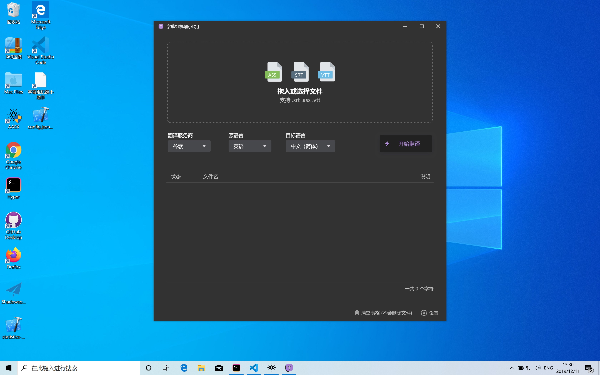
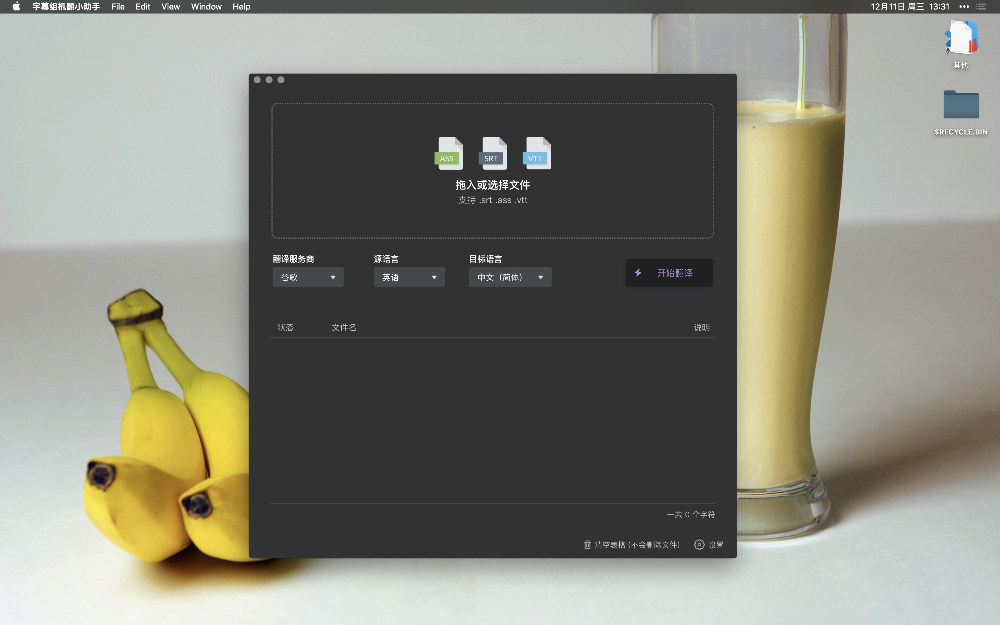

## 字幕组机翻小助手 - [下载地址](https://github.com/1c7/Translate-Subtitle-File/releases) - [演示视频](https://www.bilibili.com/video/av82675511/)

### 两大功能：
1. 可翻译字幕文件（srt/ass/vtt）    
拖入英语字幕翻译成中英双语字幕     
（也可以只保留中文）      
（也支持其他语言如德语，法语，西班牙语，日语，韩语，只要翻译服务商支持的语言，软件都支持）    

1. 支持语音转文字          
可拖入音频或视频，识别语音，得到文字，文字可以输出为纯文本或是字幕，      
如果选择输出为字幕，还可以进行后续翻译        
(目前只支持一家服务商：IBM，更多服务商后续会陆续添加）     
可以做到拖入一个英文 mp4/mkv 视频，得到中英双语字幕      

## Windows 截图

## macOS 截图

# 解决什么问题?
机器翻译字幕文件

## 适合谁用?
1. 字幕组成员（翻译视频的人）
2. 个人

## 使用场景
1. 字幕组成员：用机器翻译对字幕文件进行粗加工，然后手动改进机翻字幕，这样效率更高，产出更多
2. 个人：看些视频教程或其他类型的没字幕的视频，机翻一下字幕，对质量要求不高，大概看懂 80% 内容就行     

（备注：如果质量要求很高，要求翻译出来的中文字幕正确流畅，最好的办法当然是雇人翻译，机翻准确度在 50%~80% 左右）   

## 如何使用？
1. 进入"设置"。配置一家翻译服务商（比如彩云小译） 
1. 拖入字幕文件 (后缀 .srt .ass .vtt)
2. 选择服务商为"彩云小译", 然后选字幕源语言，比如"英文"，然后选目标语言，比如"中文"
3. 点击右侧"开始翻译"按钮即可

## 价格
软件分为:
1. 免费版
2. 专业版

### 免费版
* 每月可翻译100万字符          
  
### 专业版
* 每月可翻译字符数无上限
* 支持字符数统计功能，  
比如可以看到你用腾讯云翻译了25万个字符，用百度翻译了7万个字符，用谷歌翻译了10万个字符
* 可设置字符数上限，避免超出额度
       
### 说明1
免费版的额度很大了，   
100万字符约等于25部电影，对于95%的人是绝对够的，   
换句话说，可以一直免费使用这个软件             

如果您每月翻译的字数超过100万，可以考虑购买专业版
[价格请看这里](https://mianbaoduo.com/o/bread/YZ6Vmps=)

### 说明2
"软件的字符数"和"翻译服务商的字符数"是分开的，不是一回事。    

举个例子：谷歌的价格是 20美金/100万字符，免费额度是每月$10美金       
也就是说你每个月可以用谷歌免费翻译50万字符。  

软件的免费版是每个月最多翻译100万个字符。

假设

## 替代品
功能上完全等同的产品暂时没有    
这种自己设定 API Key 然后支持多家翻译服务商，来翻译字幕文件的软件，就这里独一家。    

宽泛一点来说：任何和字幕翻译沾边的都算的话，本软件的替代品有：  

* [网易见外](https://sight.netease.com/)
* [讯飞听见](https://www.iflyrec.com/)
* Arctime Pro

## Q 群 
982808006

<!--
### 推荐工作流
1. 调整时间轴（此时只有英文字幕）
2. 用这个工具翻译
3. 翻译后得到的中文字幕，会加到文件后面（vtt格式除外）
  （打开 Aegisub 你会看到中文都在后半部分）此时可以按住 `Shift` 键，鼠标点击 第一行中文字幕 和 最后一行中文字幕，这就选中了所有中文字幕，然后可以修改 Style
（这样中文和英文的字幕样式就不一样了，你可以把中文调大字体，英文调小字体。或不同颜色等）
4. 继续人工翻译即可
-->
