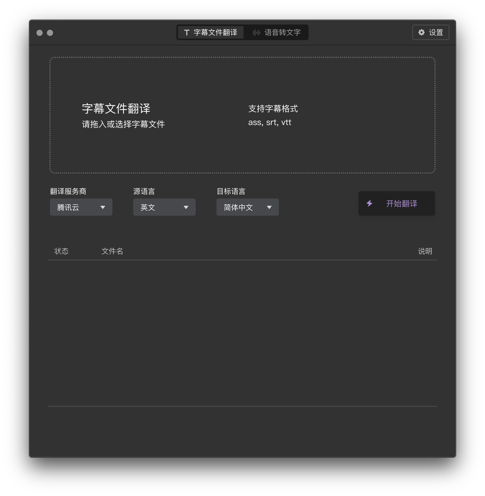
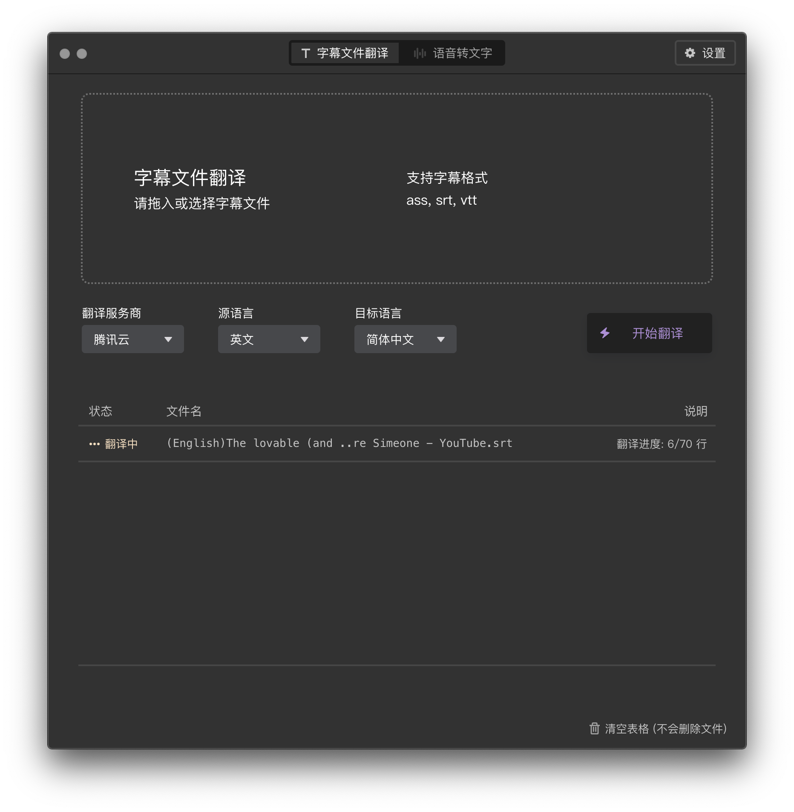
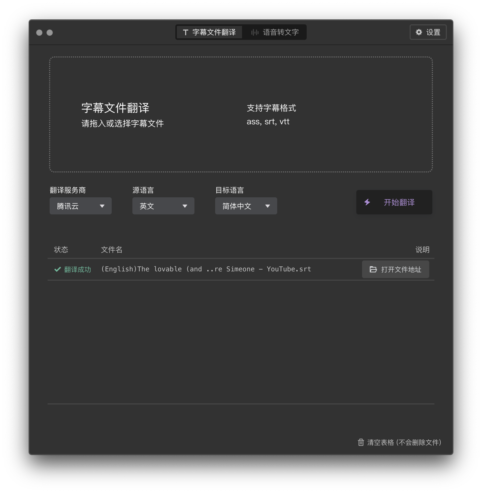
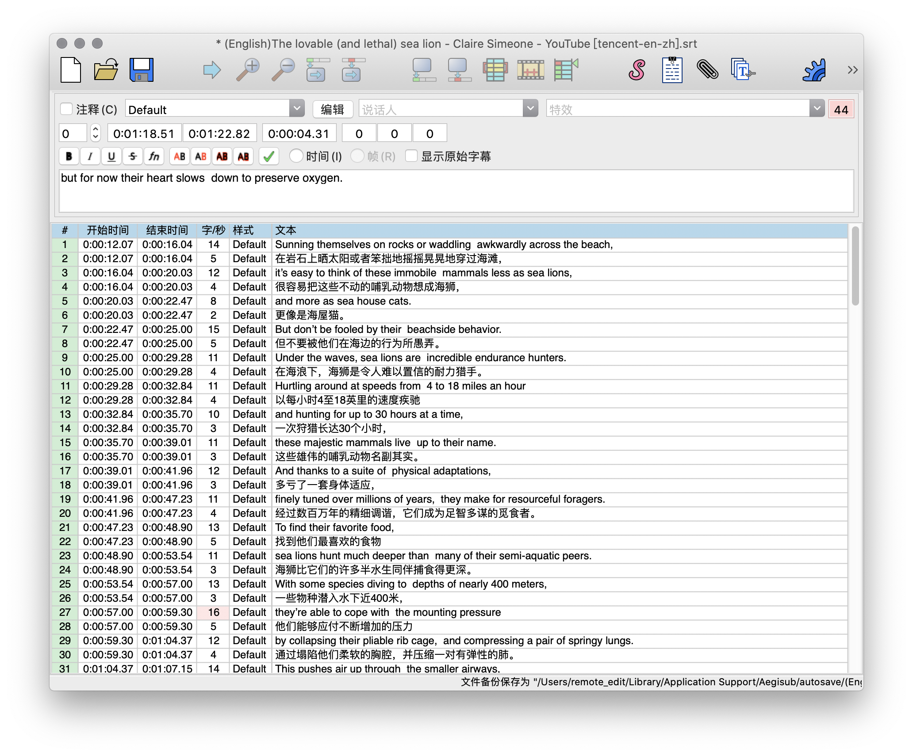
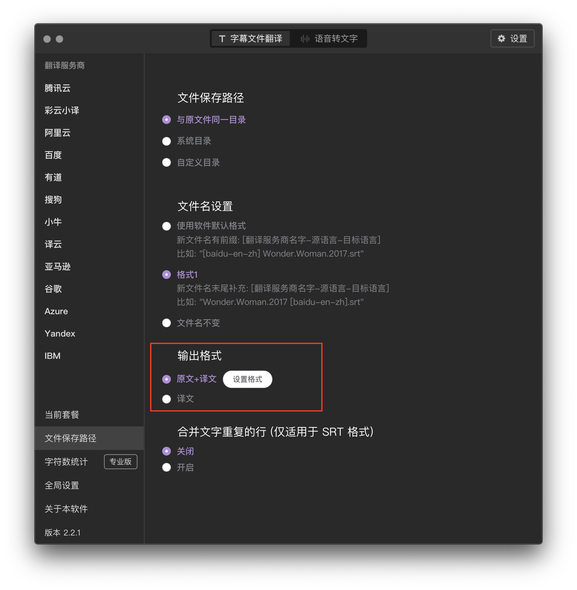
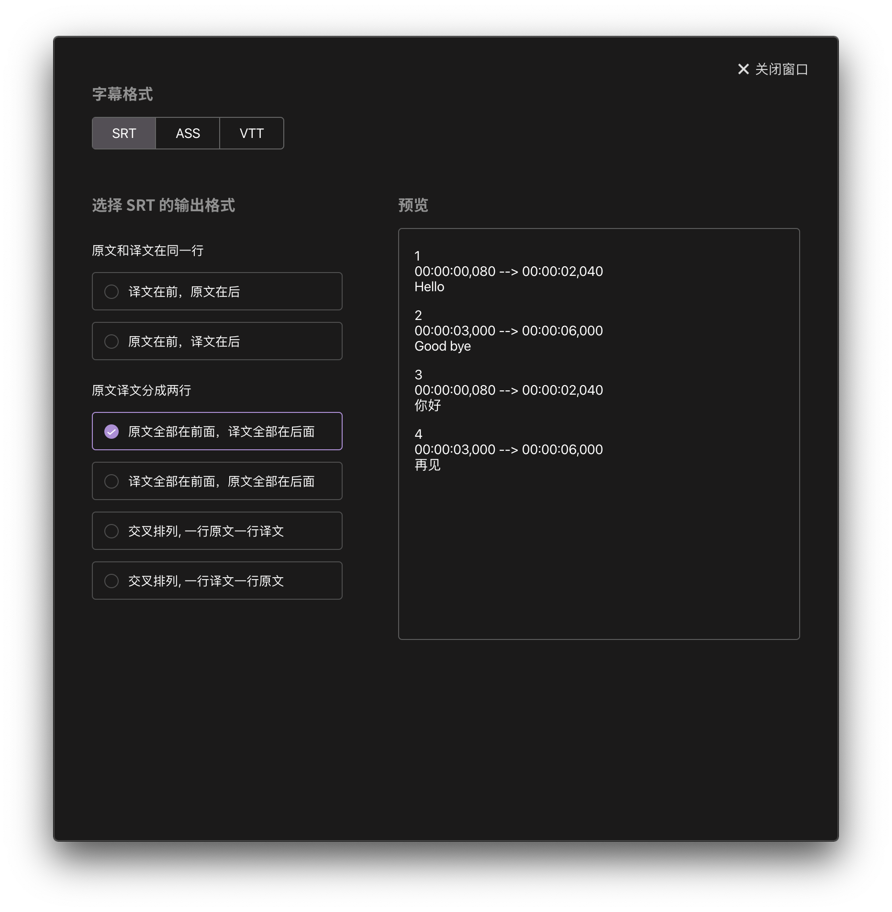
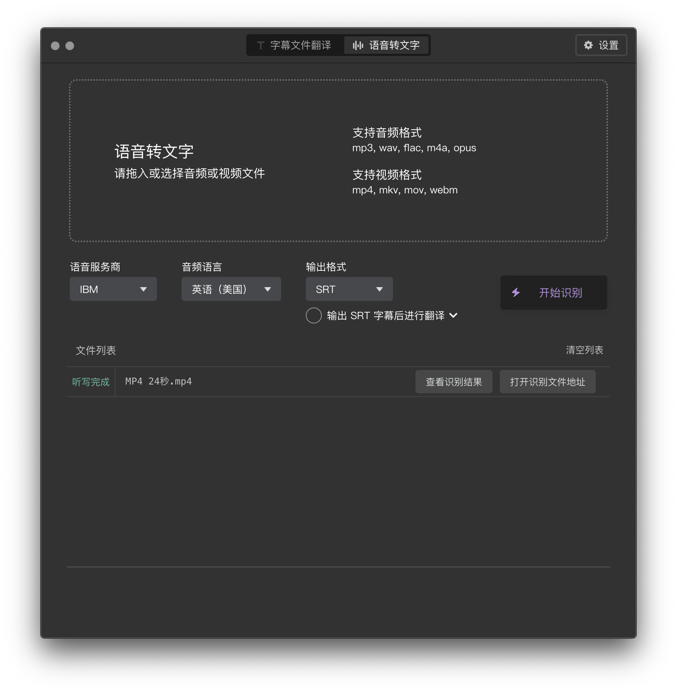
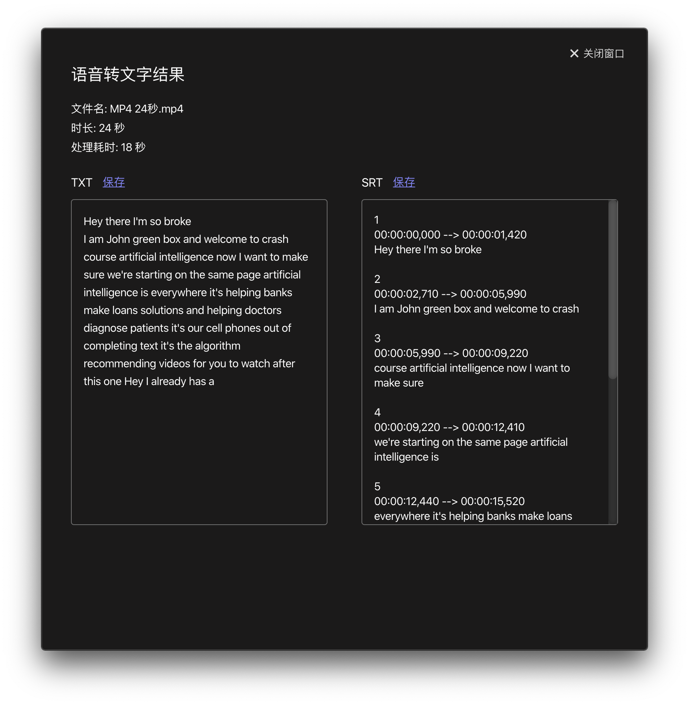
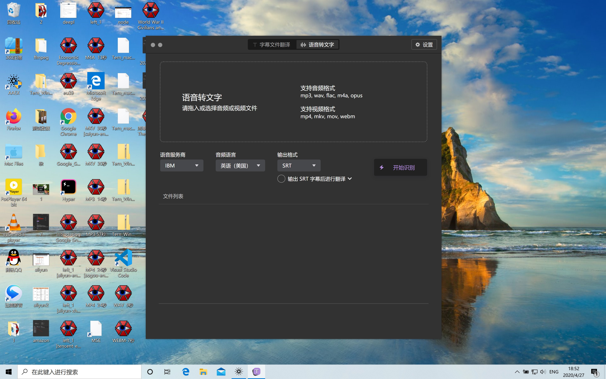
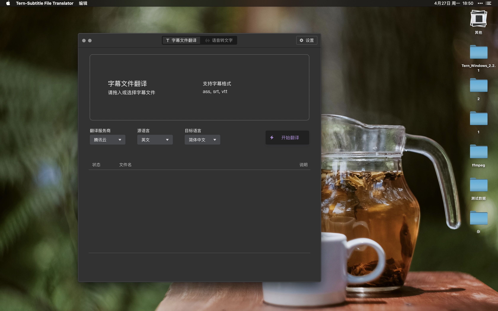

## 字幕组机翻小助手 - [视频演示](https://www.bilibili.com/video/av82675511) - [教程](https://doc.tern.1c7.me/zh/)

## 这是什么？（为您解决什么问题？）
这个软件是用来翻译字幕文件的，比如 .srt, .vtt, .ass 这样后缀的字幕文件。

## 产品优点
您可以自己配置翻译服务商的 API Key，意思是直接使用服务商的翻译 API。
* 好处：这样价格最低，没有中间商抽成，还可以合理利用服务商提供的免费额度（一般是100万字符/月的免费额度）
* 坏处：你需要自己去服务商平台上注册和申请服务，用起来会比较麻烦和复杂（比如申请百度的翻译 API 大概要5-10分钟左右）

## 重要信息
本软件有桌面端+网页端。由于桌面端遇到一些问题（因为面包多更换了域名导致无法激活专业版），现在建议先用网页端。

## 如何使用本软件？
* 网页端访问 https://tern.1c7.me/#/

## 重要通知 1 (2023年1月30号)
* 机翻小助手网页版上线了！ https://tern.1c7.me  网页版打开就能用，非常方便，欢迎尝试。
* 备注1: 版本 4.2.0 和更早的版本，都只有桌面端，必须下载使用，有些麻烦，建议先用网页版。
* 备注2：目前网页版只支持`字幕文件翻译`功能，语音转文字功能暂时没有。

## 重要通知 2（关于桌面版无法激活的问题）
* 由于2022年10月份面包多更换了域名，从 mianbaoduo.com 换成了 mbd.pub，所以机翻小助手桌面端软件的激活功能出了问题。
* 简单说就是版本 4.2.0（和之前更早的版本）都无法激活。
* 2022年10月，11月，12月，2023年1月，开发者都在写代码，2023年1月30号发布了网页版。
* 我会给网页版添加更多翻译服务商，语音转文字功能只能排期到后面。先把翻译的功能做好。

## 重要通知3
接下来的字幕翻译服务商更新路线是：
1. 百度 (已完成)
2. DeepL - 2023年2月7号上线
3. 腾讯 - 2023年2月8号上线
4. 彩云 - 已上线
5. ChatGPT - 2023年3月上线
6. 同花顺翻译 - 2023年3月上线
7. 火山引擎翻译
8. 阿里云 (票数: 2, 投票用户: 夜行书生)
10. 讯飞翻译
11. NAVER papago（用户说韩文翻译比较好）(投票数: 2, 投票用户: 宵夜， 🐳YOYO🐳)
12. 小牛 (投票数: 1, 投票用户: 熊小叔叔叔)
13. 谷歌 (投票数: 1, 投票用户: 伟★哥)
14. 有道 https://ai.youdao.com/?keyfrom=fanyi-new-nav#/
15. 亚马逊
16. Azure
17. IBM
18. Yandex

## 本软件为您解决什么问题？
解决2个问题：
1. 机翻字幕文件，用机器翻译处理 .srt .ass .vtt 文件，比如可以英翻中，也支持其他语言（具体支持哪些语言，看你选的是哪家服务商）
2. （仅桌面版可用）语音转文字，比如拖入 .mp4 .mkv .mp3 .aac .m4a .ts 等视频音频文件，机器生成字幕，输出的文件可以是 .txt(纯文本) 和 .srt (字幕)

## 桌面版下载地址
* [下载 Windows 版本 (.zip)](https://github.com/1c7/Translate-Subtitle-File/releases/download/4.1.0/Tern_Windows_4.1.0.zip) 下载后如何使用：解压 zip 得到一个文件夹，找 .exe 文件，双击即可    
* [下载 macOS 版本 (.dmg)](https://github.com/1c7/Translate-Subtitle-File/releases/download/4.1.0/Tern_macOS_4.1.0.dmg) 下载后如何使用：双击 dmg，打开后把 App 拖入到应用程序里即可，和其他 App 的安装方式一致

## 媒体评价
* [少数派: App+1 | 让「熟肉」来得更快一点，省时省力制作双语字幕：Tern （2020年2月29号）](https://sspai.com/post/59168)
* [小众软件：Tern – 字幕组机翻小助手：自动翻译英文字幕为中英双语字幕[Win/macOS]（2020年1月12号）](https://www.appinn.com/tern-subtitle-file-translator/)

## 软件外观（桌面版）

## 解决什么问题？：1. 翻译字幕文件
比如拖入英语字幕，翻译成中英双语字幕   

   
   
   

### 说明
1. 支持三种字幕格式：.srt，.ass，.vtt      
2. 支持多种语言如德语，法语，日语，韩语，俄语，西班牙语，意大利语（只要翻译服务商支持，软件就支持）    
3. 如果不想要中英双语，也可以只要中文，不要英文（具体设置方法见下方截图）

### 设置输出格式
设置为"译文"即可（下图中的红框里，从上往下数起，第二个选项）   
   

如果想要中英双语，那么需要设置成"原文+译文"，点击右侧白色按钮可"设置格式"   

## 解决什么问题？：2. 可以语音转文字          
拖入音频或视频，识别出文字，然后输出为"纯文本"或"字幕"   
音频支持: `mp3, flac, wav, m4a, opus`    
视频支持: `mp4, mkv, mov, webm, avi, wmv`  

说明：
1. 如果选择"输出为字幕"，还可以进行后续翻译，可以做到拖入视频，得到中英双语字幕  

## 软件支持两个操作系统：Windows 和 macOS
## Windows 下的运行截图

## macOS 下的运行截图

## 适合谁用?
1. 个人
1. 字幕组（翻译视频的人）

## 使用场景
1. 个人：看视频教程或其他没字幕的视频，机翻一下字幕，对质量要求不高，大概看懂 80% 内容就行   
1. 字幕组：先用机器翻译对字幕进行粗加工，然后再手动改进，这样效率更高

（备注：如果你对字幕质量要求很高，想要信达雅，最好还是雇人翻译。机器翻译的准确度区间 50%~85%）   

## 价格 (Pricing)
软件分为两个版本:
1. 免费版（适合95%的人）
2. 专业版

## 免费版的特点
* 字幕翻译：每个月上限 100 万字符 （上限重置时间：次月1号）   
* 语音转文字：每个月上限 10 小时 （上限重置时间：次月1号）            

## 专业版的特点
* 字幕翻译：翻译字符无上限
* 语音转文字：无时间上限
* 字幕翻译：提供字符数统计功能，  
可以看到用腾讯云翻译了 25 万个字符，用百度翻译了 7 万个字符，用谷歌翻译了 10 万个字符。   
可单独为服务商设置字符数上限，避免超出额度
* 语音转文字：支持时长统计

重要说明：专业版的"无上限"指的是软件本身不做任何使用量的限制（免费版会做限制，参考上一段说明）    
"无上限"和服务商没有任何关系，"无上限"不等于免费，   
服务商该怎么计费还是怎么计费，服务商怎么收费不会受到软件是"免费版"还是"专业版"的影响。     

举个实际例子，阿里云的语音转文字服务，每天的免费额度是2小时（有效期3个月）         
假设你连续5天，每天都把2小时的免费额度用完，     
那么在第6天，虽然阿里云的免费额度还有，但是软件的免费版10小时已经到了，就会提示无法继续使用了。      
除非等到下个月1号重置，或者随便买一个专业版（比如7天的专业版) 就可以继续使用了。     

### 当你购买这款软件的专业版，你实际上购买的价值是：
1. 一个漂亮的图形界面
2. 通过这个界面可以"直接"使用服务商提供的服务，中间没有经过任何第三方。        
   （'语音转文字'服务或是'翻译'服务）        
3. 因为是"直接"使用的服务商，那么你直接给服务商交费就行        
    （因此，费用不可能比这个还低了，而且你还可以用服务商提供的免费额度）    
       
## 支持的服务商列表

### 字幕翻译支持如下服务商(共13家):
* 彩云
* 腾讯云
* 百度
* 阿里云
* 有道
* 搜狗
* 小牛
* 译云
* 亚马逊
* 谷歌
* Azure
* Yandex
* IBM
* DeepL  

[查看表格: 免费额度和价格](https://doc.tern.1c7.me/zh/folder/pricing/)

### 语音转文字支持如下服务商(共6家):
* IBM
* Azure
* Amazon
* 讯飞
* 阿里云
* 腾讯云  

[查看表格: 免费额度和价格](https://doc.tern.1c7.me/zh/folder/pricing_sound/)

说明：所有语音转文字服务商都支持"任务历史"功能，    
意思是只要文件成功传给服务商，服务商开始处理了，那么就可以关掉软件，不需要一直开着。      
过一阵子再回来看任务做完没    

## 语音转文字的免费额度
* 阿里云：每天2小时（有效期3个月）
* 讯飞：5个小时（一次性）
* 腾讯云：10小时（每个月）
* Amazon：60分钟（每个月）
* Azure：60分钟（每个月）
* IBM：500分钟（每个月）（500分钟 = 8小时20分钟）

## [使用教程看这里](https://doc.tern.1c7.me/zh/)
基本概念：
1. 先设置一家服务商，如果要用字幕翻译，就设置一家翻译服务商，如果要用语音转文字，就设置一家语音服务商
2. 拖入文件，字幕的文件后缀是 `.ass .vtt .srt`，音视频的文件后缀是 `.mp4 .mkv .mp3 .flac .wav .m4a .opus`
3. 从下拉菜单中选择服务商，选择源语言和目标语言(如果是字幕翻译)，或者选择音频语言(如果是语音转文字)，点击右侧"开始"按钮，就会开始处理了

## 推荐哪家服务商？
### 如果是字幕翻译
* 推荐先申请`百度`，因为免费额度无限，而且注册流程较快，无需等待人工审核，照着"使用教程"一步步做大概5分钟就行

* `彩云`每个月免费额度100万，不过申请流程中有人工审核，因此需要1-3天，可以先申请了然后过几天看成功没，如果急用就不要申请彩云，来不及。

* 其他服务商可以自己一个个试试，因为很难打分评比出哪个服务商"最好"

### 如果是语音转文字
* 推荐用`阿里云`，因为每天2个小时的免费额度

* `讯飞`的免费额度是5小时（一次性）
   不过只支持中文和英文两种语言

* 简而言之：如果要识别中文，推荐`阿里云，讯飞，腾讯云`（按这个顺序）   

* 如果要识别英文，推荐 `IBM Azure Amazon` （英语是这些服务商的母语，按理应该比国内服务商好那么一些，用户可以自行对比试试）     

* 如果要识别其他语言，日语，泰语，德语，法语等等，自己先在下拉列表里找一找，看看哪家服务商支持你想要的语言，然后再去申请那家服务商

# 替代品 （和本软件功能相似的其他软件）
## [字幕酱](https://www.zimujiang.com/aff?code=pre024rf): 
使用简单。打开网页即可使用，不是桌面软件（好评）      
如果嫌弃机翻助手配置很麻烦，希望不要配置直接用，那么用字幕酱。         
官方的费用说明：1分钟内免费，最低可0.2元/分钟    
（费用说明文字复制于官网，时间2020年8月28号，价格请以官方最新说明为准，此处仅提供参考）    

## [VideoSRT](https://github.com/wxbool/video-srt-windows): 
操作系统：支持 Windows，不支持 macOS       
支持阿里云作为语音转文字服务商，    
百度和腾讯作为翻译服务商（也就是支持的服务商数量没有本软件多）     
界面美观程度稍差一点点（相对于本软件而言）    
但客服比较好，两个 Q 群都有500人左右，群内活跃度较高

## [网易见外](https://sight.netease.com/)：
贵       
[英译中￥32/分钟，中译英￥35/分钟](https://sight.youdao.com/price#detail)

## [讯飞听见](https://www.iflyrec.com/)
贵        
机器快转0.33元/分钟, 中文人工精转 80元/小时起

## [Arctime Pro](http://arctime.cn/service.html)
贵    
文档原话：（Arctime平台采用“积分”作为统一的虚拟货币，1元=100积分）    
全自动语音转写每分钟价格：普通话/粤语/英语30积分，其他语种45积分。机器翻译每100字符扣除1积分。    

## [Autosub](https://github.com/BingLingGroup/autosub)    
学习成本对非程序员太高。    
是命令行工具，没有图形界面，       
   
截止到2020年8月28日，支持4家语音转文字服务商：谷歌的2个+讯飞+百度。   
（我也没有搞懂谷歌那2个有啥区别）    

基本原理是把音频拆分成多个60秒以下的文件，然后通过服务商的短语音识别 API 进行识别，    
最终输出字幕文件（srt, ass 等格式）    

## [pyTranscriber](https://github.com/raryelcostasouza/pyTranscriber)
pyTranscriber 就是给 Autosub 包了一层图形界面，（用的 PyQT）       
系统支持：支持 Windows 和 Linux, macOS 最多只到 Mojave 和之前。   
（对 macOS 的支持程度这一段说明来自 [Release 页面](https://github.com/raryelcostasouza/pyTranscriber/releases/tag/v1.4-stable))

## 对比
在同时满足以下条件下，其他软件没有本软件好：

1. 便宜    
    1. 服务商有免费额度    
    2. 哪怕付费也是直接给服务商付费，没有中间商提价    
    价格不可能比这个还低了
2. 界面美观
3. 可批量处理文件（字幕/音频/视频）
4. 支持市面上几乎所有服务商，用户可以随意自由切换服务商使用

## 软件作者联系方式
邮件: guokrfans@gmail.com  
QQ: `1003211008`

## 用户 QQ 群 （欢迎加群）
* 三群: 128986462（人数: 2/200）
* 二群：658774053（人数: 500/500）
* 一群：982808006（人数: 495/500）  

## 推荐一下别人的产品
1. 字幕酱 https://www.zimujiang.com/
2. VideoSrt Pro https://www.yuque.com/viggo-t7cdi/videosrt-pro/cpwtwl

