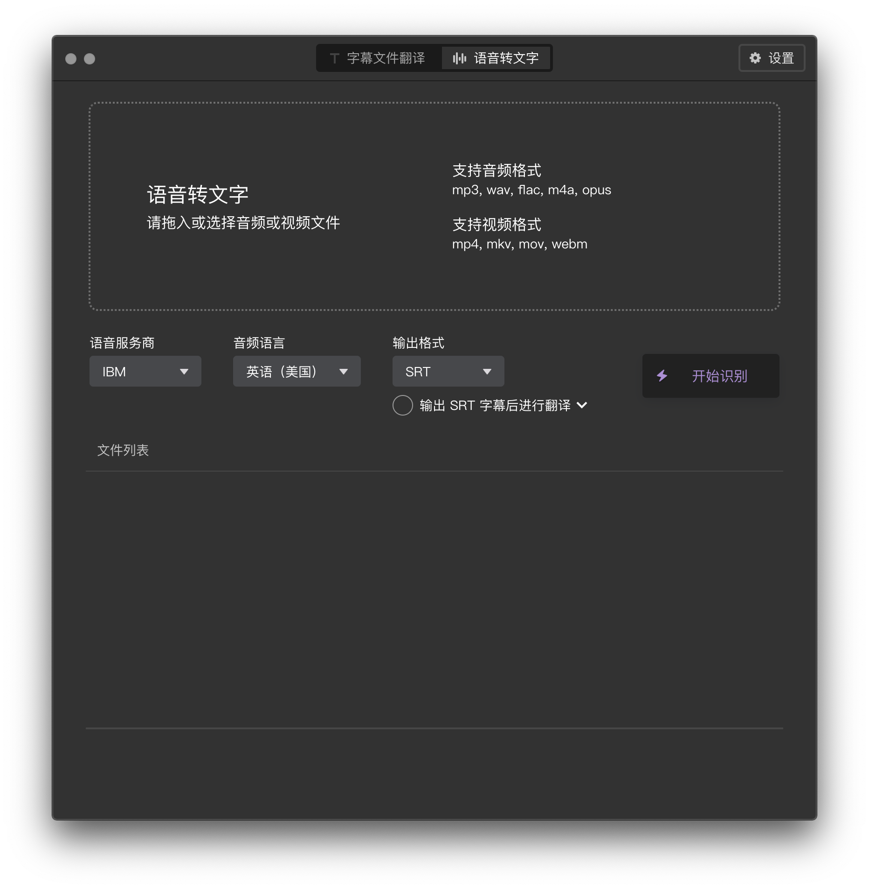

## 字幕组机翻小助手 - [视频演示](https://www.bilibili.com/video/av82675511) - [文档教程](https://doc.tern.1c7.me/zh/)
桌面软件，支持 Windows + macOS

## 下载地址
* [下载 Windows 版本 (.zip)](https://tern-release.oss-cn-shenzhen.aliyuncs.com/Tern_Windows_2.9.0.zip)    
* [下载 macOS 版本 (.dmg)](https://tern-release.oss-cn-shenzhen.aliyuncs.com/Tern_macOS_2.9.0.dmg)

## 媒体评价
* [少数派对 Tern 的介绍](https://sspai.com/post/59168)
* [小众软件对 Tern 的介绍](https://www.appinn.com/tern-subtitle-file-translator/)

## 软件外观

## 解决的问题：1. 可以翻译字幕文件
举例：拖入英语字幕，翻译成中英双语字幕   

   
   
   

### 说明
1. 也可以只保留中文，不要原文      
2. 也支持其他语言如德语，法语，日语，韩语，俄语，西班牙语，意大利语，只要翻译服务商支持的语音，软件都支持    
3. 支持当前主流的三种字幕格式：.srt，.ass，.vtt   

### 还可以设置字幕的输出格式
比如是"只要原文"还是"原文和译文都要"   
   

如果都要，输出的格式是怎样的   

## 解决的问题：2. 可以语音转文字          
举例：拖入音频或视频，识别出文字，然后输出为"纯文本"或"字幕"  

说明：
1. 如果选择"输出为字幕"，还可以进行后续翻译，可以做到拖入视频，得到中英双语字幕  

## 本软件支持 Windows + macOS
## Windows 截图

## macOS 截图

## 适合谁用?
1. 个人
1. 字幕组（翻译视频的人）

## 使用场景
1. 个人：看视频教程或其他没字幕的视频，机翻一下字幕，对质量要求不高，大概看懂 80% 内容就行   
1. 字幕组：先用机器翻译对字幕进行粗加工，然后再手动改进，这样效率更高

（备注：如果你对字幕质量要求很高，想要信达雅，最好还是雇人翻译。机器翻译的准确度区间 50%~85%）   

## 价格 (Pricing)
软件分为两个版本:
1. 免费版（适合95%的人）
2. 专业版

## 免费版的特点
* 字幕翻译：每月最多翻译100万字符 （每月1号重置）   
* 语音转文字：最多10小时 （每月1号重置）            

## 专业版的特点
* 字幕翻译：翻译字符无上限
* 语音转文字：无时间上限
* 字幕翻译：支持字符数统计功能，  
可以看到用腾讯云翻译了 25 万个字符，用百度翻译了 7 万个字符，用谷歌翻译了 10 万个字符。可单独为服务商设置字符数上限，避免超出额度
* 语音转文字：支持时长统计
       
## 支持的服务商列表

### 字幕翻译支持如下服务商(共13家):
* 彩云
* 腾讯云
* 百度
* 阿里云
* 有道
* 搜狗
* 小牛
* 译云
* 亚马逊
* 谷歌
* Azure
* Yandex
* IBM
* DeepL

### 语音转文字支持如下服务商(共6家):
* IBM
* Azure
* Amazon
* 讯飞
* 阿里云
* 腾讯云

所有语音转文字服务商均支持"任务历史"功能，    
只要文件成功传给服务商，服务商开始处理了，那么就可以关掉软件，不需要一直开着。      
过一阵子再回来看任务做完没    

## 替代品 
如果不用这个软件，有什么其他软件来机翻字幕？   

* [字幕酱](https://www.zimujiang.com/): 使用简单 (这个是认识的朋友做的)
* [VideoSRT](https://github.com/wxbool/video-srt-windows): (Windows 独占)
* [网易见外](https://sight.netease.com/)
* [讯飞听见](https://www.iflyrec.com/)
* Arctime Pro

## 用户 Q 群
982808006    

不管是免费还是付费用户都欢迎加入 QQ 群           
