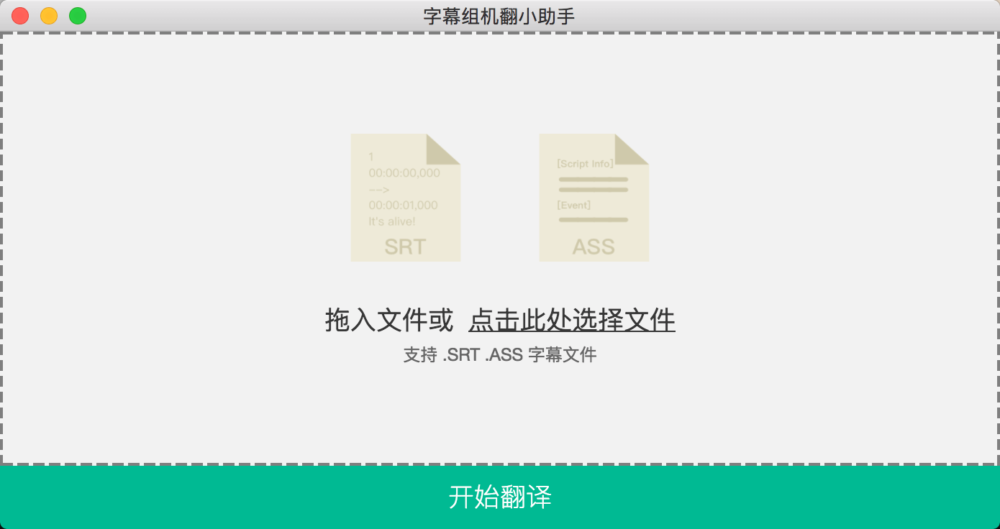

## 字幕组机翻小助手 （使用谷歌翻译）（免费开源，不带广告）
字幕翻译时，每个汉字都手打太累了，机翻虽然不正确但工作量变成了删字，轻松不少。

## 如何使用
拖入 .srt/.ass 字幕文件，点击绿色按钮"开始翻译"        
1~2秒后就会翻译完成，在文件夹中显示。     

## 下载地址
macOS 用户下载地址：

## 重要说明
请自备科学上网工具，因为本程序使用了 Google 翻译。

---

#### 有任何疑问，或是想反馈问题
1. 欢迎在 Github 开 Issue
2. 也可以微博找我：新浪微博@糖醋陈皮
3. 发邮件: guokrfans#gmail.com (#替换成@)

#### 未来计划
因为只是个简单小工具，所以我想保持免费，那么就不能投入过多时间，           
除了偶尔修复下影响正常使用的问题。不会有大改动（加新功能，UI 大改版）       
除非有人愿意加入进来一起开发，不然会保持这种 "能用就行" 的状态。    
如果投入过多时间可能会被迫要收费了，不管是广告还是一次性收费还是订阅付费都不太好。    

#### 关于
这个小工具的用意是加快翻译速度，    
我们 Crash Course 字幕组内部从2015年开始就用自己写的 Python 来翻译字幕文件，       
把 ass 字幕文件拖到一个 .py 文件上方，然后会弹出黑窗口，逐行翻译。   
发布 Python 程序比较费事，无法点开即用。

这次用 Electron.js 写跨平台应用方便很多，有图形界面可以打开即用。    
希望能节省你不少时间    